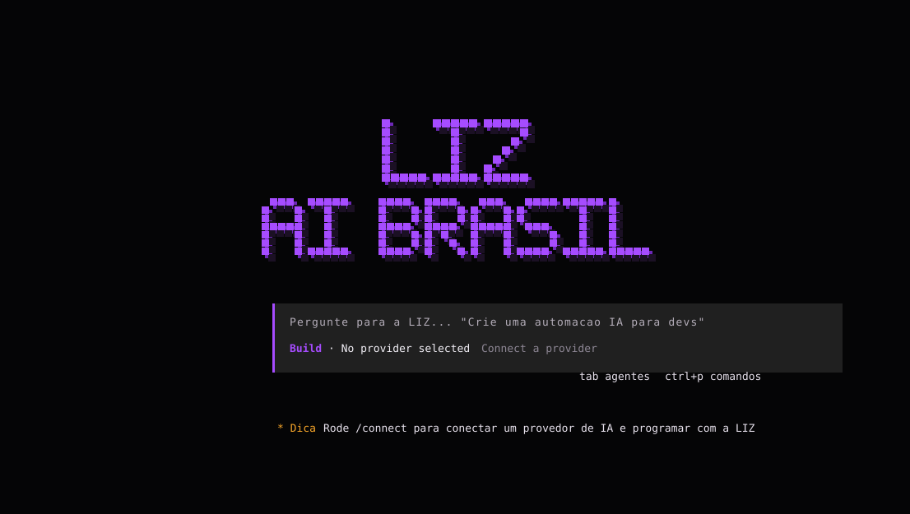

  

---

## LIZ AI BRASIL

Este e o repositorio oficial da LIZ AI BRASIL.

A LIZ AI BRASIL e uma plataforma de desenvolvimento com IA criada para oferecer uma experiencia integrada entre interface, conta, modelos oficiais e ferramentas de produtividade.

## Modelos Oficiais

A interface do produto deve apresentar os modelos oficiais da Liz:

- Liz 2.3
- Liz 2.5 PRO
- Liz 2.6 PRO

## Documentacao Publica

Este README apresenta apenas informacoes institucionais do projeto.

Detalhes internos de infraestrutura, autenticacao, distribuicao, operacao e seguranca devem permanecer fora da documentacao publica.

## Licenca

Este projeto e protegido por licenca proprietaria da LIZ AI BRASIL.

O acesso ao repositorio publico nao concede permissao para copiar, redistribuir, revender, hospedar ou criar derivados sem autorizacao por escrito da LIZ AI BRASIL.

---

  <strong>LIZ AI BRASIL</strong>

